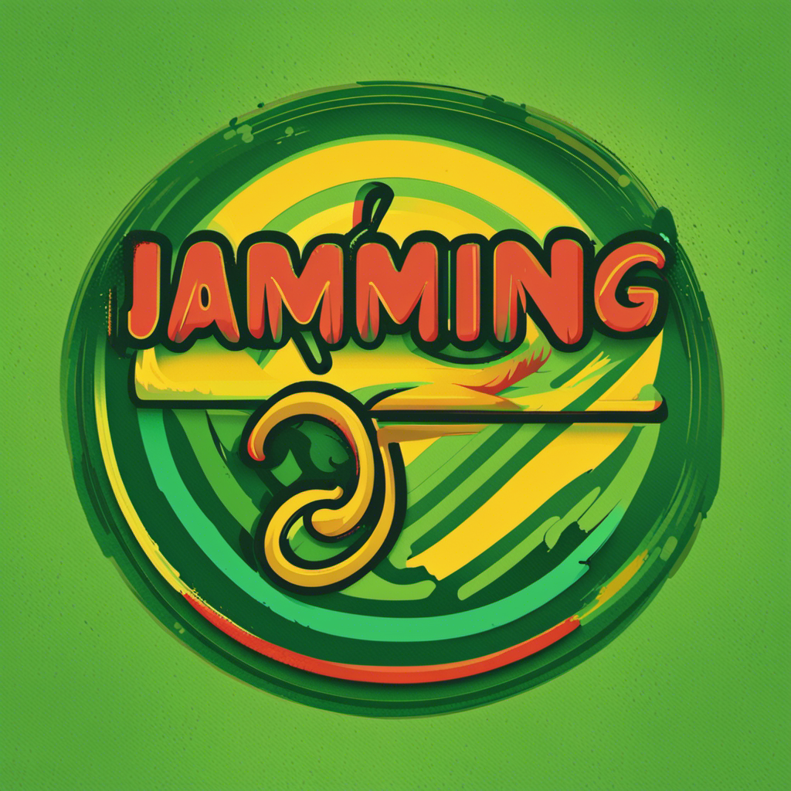

<!-- Improved compatibility of back to top link: See: https://github.com/othneildrew/Best-README-Template/pull/73 -->
<a name="readme-top"></a>
<!--
*** Thanks for checking out the Best-README-Template. If you have a suggestion
*** that would make this better, please fork the repo and create a pull request
*** or simply open an issue with the tag "enhancement".
*** Don't forget to give the project a star!
*** Thanks again! Now go create something AMAZING! :D
-->


<!-- PROJECT SHIELDS -->
<!--
*** I'm using markdown "reference style" links for readability.
*** Reference links are enclosed in brackets [ ] instead of parentheses ( ).
*** See the bottom of this document for the declaration of the reference variables
*** for contributors-url, forks-url, etc. This is an optional, concise syntax you may use.
*** https://www.markdownguide.org/basic-syntax/#reference-style-links


TODO Come back to this section when you've got a project up and running
[![Contributors][contributors-shield]][contributors-url]
[![Forks][forks-shield]][forks-url]
[![Stargazers][stars-shield]][stars-url]
[![Issues][issues-shield]][issues-url]
[![MIT License][license-shield]][license-url]
[![LinkedIn][linkedin-shield]][linkedin-url]

-->


<!-- PROJECT LOGO -->
<br />
<div align="center">
  <a href="https://github.com/nostromos/jammming">
    
  </a>

<h3 align="center">Jammming</h3>

  <p align="center">
    A website that allows users to search the Spotify library, create a custom playlist, then save it to their Spotify account.
    <br />
    <a href="https://github.com/nostromos/jammming"><strong>Explore the docs »</strong></a>
    <br />
    <br />
    <!-- TODO Update demo link when the app is ready to be deployed
    <a href="https://github.com/nostromos/jammming">View Demo</a>
    ·
    -->
    <a href="https://github.com/nostromos/jammming/issues">Report Bug</a>
    ·
    <a href="https://github.com/nostromos/jammming/issues">Request Feature</a>
  </p>
</div>


<!-- TABLE OF CONTENTS -->
<details>
  <summary>Table of Contents</summary>
  <ol>
    <li>
      <a href="#about-the-project">About The Project</a>
      <ul>
        <li><a href="#built-with">Built With</a></li>
      </ul>
    </li>
    <li>
      <a href="#getting-started">Getting Started</a>
      <ul>
        <li><a href="#prerequisites">Prerequisites</a></li>
        <li><a href="#installation">Installation</a></li>
      </ul>
    </li>
    <li><a href="#usage">Usage</a></li>
    <li><a href="#roadmap">Roadmap</a></li>
    <li><a href="#contributing">Contributing</a></li>
    <li><a href="#license">License</a></li>
    <li><a href="#contact">Contact</a></li>
    <li><a href="#acknowledgments">Acknowledgments</a></li>
  </ol>
</details>


<!-- ABOUT THE PROJECT -->
## About The Project

A website that allows users to search the Spotify library, create a custom playlist, then save it to their Spotify account. A lot of this stuff seems pretty basic to any experienced devs but this is a big reach for me and will take some time. If I make it to initial release, that'll be a victory. I may come up with ideas for future features & enhancements down the line and while I'll track those in issues, I may not continue to develop this further.

The main goals of this project are:

- Building a web app using React
- Version controlling the application with Git and host the repository on GitHub
- Integrating with Spotify (maybe others too)
- Deploying the application somewhere cost-effective
- Writing good documentation ncluding:
    - The purpose of the project
    - Technologies used
    - How to get it set up yourself
    - Features
    - Future work

The basic feature list should include:
- Users can search for songs by song title.
- You can also include functionality to search by other attributes like artist’s name, genre, etc.
- Users can see information about each song like title, artist, and album for songs they queried
- You can also include other information – the design is up to you
- Users can export their custom playlist to their personal Spotify account

Prerequisites:
- HTML
- CSS
- JavaScript
- React
- HTTP Requests and Responses
- Authentication


<!-- TODO Update with a screenshot when the initial release is built and deployed
[![Product Name Screen Shot][product-screenshot]](https://example.com)
-->
<p align="right">(<a href="#readme-top">back to top</a>)</p>


### Built With

* [![React][React.js]][React-url]
<!-- TODO Add spotify badge to the 'built with' section along with whatever other tech i'm using -->

<p align="right">(<a href="#readme-top">back to top</a>)</p>


<!-- GETTING STARTED -->
<!-- TODO Build out this section when the project is deployed
## Getting Started

This is an example of how you may give instructions on setting up your project locally.
To get a local copy up and running follow these simple example steps.

### Prerequisites

This is an example of how to list things you need to use the software and how to install them.
* npm
  ```sh
  npm install npm@latest -g
  ```

### Installation

1. Get a free API Key at [https://example.com](https://example.com)
2. Clone the repo
   ```sh
   git clone https://github.com/nostromos/jammming.git
   ```
3. Install NPM packages
   ```sh
   npm install
   ```
4. Enter your API in `config.js`
   ```js
   const API_KEY = 'ENTER YOUR API';
   ```

<p align="right">(<a href="#readme-top">back to top</a>)</p>

-->

<!-- USAGE EXAMPLES -->
<!-- Add usage examples and a walkthrough when the project is deployed
## Usage

Use this space to show useful examples of how a project can be used. Additional screenshots, code examples and demos work well in this space. You may also link to more resources.

_For more examples, please refer to the [Documentation](https://example.com)_

<p align="right">(<a href="#readme-top">back to top</a>)</p>
-->

<!-- ROADMAP -->
## Roadmap

See the [roadmap for initial release](https://github.com/users/Nostromos/projects/2/views/2) for a list of basic features and functionality.

See the [open issues](https://github.com/nostromos/jammming/issues) for a full list of proposed features (and known issues).

<p align="right">(<a href="#readme-top">back to top</a>)</p>


<!-- CONTRIBUTING -->
## Contributing

Any contributions you make are **greatly appreciated**.

If you have ideas for this project, please open an issue describing your idea and tag is as 'enhancement'.

If you've worked on code that would make this better, please fork the repo and create a pull request. 
Don't forget to star the project if you found it useful/interesting.

1. Fork the Project
2. Create your Feature Branch (`git checkout -b feature/AmazingFeature`)
3. Commit your Changes (`git commit -m 'Add some AmazingFeature'`)
4. Push to the Branch (`git push origin feature/AmazingFeature`)
5. Open a Pull Request

<p align="right">(<a href="#readme-top">back to top</a>)</p>


<!-- LICENSE -->
<!-- TODO figure out the license for this
## License

Distributed under the MIT License. See `LICENSE.txt` for more information.

<p align="right">(<a href="#readme-top">back to top</a>)</p>

-->

<!-- CONTACT -->
## Contact

Your Name - [@earnestposting](https://twitter.com/earnestposting) - github@what.lol

Project Link: [https://github.com/nostromos/jammming](https://github.com/nostromos/jammming)

<p align="right">(<a href="#readme-top">back to top</a>)</p>


<!-- ACKNOWLEDGMENTS -->
## Acknowledgments

* [Codecademy](https://codecademy.com)
* [Othneil Drew](https://github.com/othneildrew) for his README template.

<p align="right">(<a href="#readme-top">back to top</a>)</p>


<!-- MARKDOWN LINKS & IMAGES -->
<!-- https://www.markdownguide.org/basic-syntax/#reference-style-links -->
[contributors-shield]: https://img.shields.io/github/contributors/nostromos/jammming.svg?style=for-the-badge
[contributors-url]: https://github.com/nostromos/jammming/graphs/contributors
[forks-shield]: https://img.shields.io/github/forks/nostromos/jammming.svg?style=for-the-badge
[forks-url]: https://github.com/nostromos/jammming/network/members
[stars-shield]: https://img.shields.io/github/stars/nostromos/jammming.svg?style=for-the-badge
[stars-url]: https://github.com/nostromos/jammming/stargazers
[issues-shield]: https://img.shields.io/github/issues/nostromos/jammming.svg?style=for-the-badge
[issues-url]: https://github.com/nostromos/jammming/issues
[license-shield]: https://img.shields.io/github/license/nostromos/jammming.svg?style=for-the-badge
[license-url]: https://github.com/nostromos/jammming/blob/master/LICENSE.txt
[linkedin-shield]: https://img.shields.io/badge/-LinkedIn-black.svg?style=for-the-badge&logo=linkedin&colorB=555
[linkedin-url]: https://linkedin.com/in/monaghanmike
[product-screenshot]: images/screenshot.png
[React.js]: https://img.shields.io/badge/React-20232A?style=for-the-badge&logo=react&logoColor=61DAFB
[React-url]: https://reactjs.org/